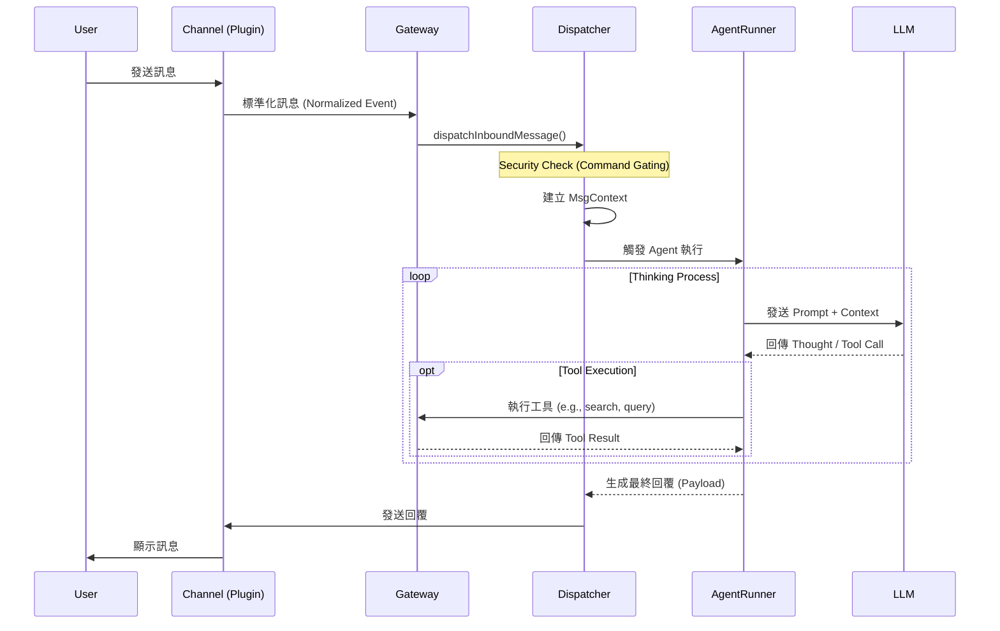

# OpenClaw 架構文件

本文檔詳細說明 OpenClaw 專案的系統架構、核心組件、資料流向與擴充機制。

## 1. 系統概述 (System Overview)

OpenClaw 是一個基於 Node.js 與 TypeScript 構建的高擴充性多渠道 AI Gateway。其核心目標是作為不同通訊平台（如 WhatsApp, Telegram, Discord, Slack）與 AI Agent 之間的中介層，提供統一的訊息處理、上下文管理與工具執行環境。

### 1.1 技術堆疊 (Technology Stack)
*   **Runtime**: Node.js v22+
*   **Core Server**:
    *   **HTTP**: Express, Hono
    *   **WebSocket**: ws
    *   **Discovery**: @homebridge/ciao (mDNS/Bonjour)
*   **AI Agent**:
    *   **Framework**: @mariozechner/pi-agent-core (ReAct Pattern)
    *   **Providers**: OpenAI, Anthropic, Google Gemini, AWS Bedrock
*   **Channel Protocol**:
    *   **WhatsApp**: @whiskeysockets/baileys
    *   **Telegram**: Grammy
    *   **Slack**: @slack/bolt
    *   **Line**: @line/bot-sdk
*   **Media Processing**: Sharp (Image), node-edge-tts (Audio), PDF.js
*   **Validation**: Zod, TypeBox, Ajv
*   **Database**: SQLite (via sqlite-vec for vector search), Filesystem (Config/Sessions)

## 2. 核心組件 (Core Components)

### 2.1 Gateway Server (`src/gateway`)
Gateway 是系統的中樞神經，負責應用程式的生命週期管理與網路通訊。它採用 **微核心 (Micro-kernel)** 設計模式，核心僅負責啟動與資源調度，具體功能透過 Plugin 擴充。

*   **設計模式與概念**：
    *   **Dependency Injection (DI)**：透過 `createDefaultDeps` 與 `RuntimeEnv` 將依賴注入各個模組，提高可測試性。
    *   **Event-Driven Architecture**：大量使用事件廣播 (Broadcast) 機制（如 `onAgentEvent`, `onHeartbeatEvent`）來解耦組件間的互動。
    *   **Standardization (Normalization)**：Gateway 不直接處理各個 Channel 的特異性，而是要求所有 Channel Plugin 將訊息轉換為統一的標準格式。

*   **初始化流程 (`server.impl.ts`)**：
    1.  **配置載入**：讀取與遷移 `config.yaml`，處理 Legacy 設定。
    2.  **Plugin 載入**：掃描並掛載 `extensions/` 目錄下的插件，執行 `autoEnable` 邏輯。
    3.  **Runtime 建置**：初始化 HTTP/WebSocket Server, 廣播系統 (Broadcaster), 與狀態管理器 (State Manager)。
    4.  **服務啟動**：依序啟動 Cron, Discovery, Tailscale, Channels 等子服務。

*   **通訊協定**：
    *   **HTTP Server**：提供 REST API (如 Control UI, Webhooks, OpenAI-compatible Chat Completions)。
    *   **WebSocket Server**：處理即時事件推送、前端控制指令、以及與 Client App 的雙向通訊。
    *   **Canvas Host**：一個專用的 HTTP Server，用於渲染與託管動態 UI 組件 (A2UI)。

*   **關鍵服務**：
    *   **Discovery (`server-discovery.ts`)**：透過 mDNS (Bonjour) 廣播服務，支援區域網路內的 Client 自動發現 Gateway。
    *   **Tailscale Integration (`server-tailscale.ts`)**：內建 Tailscale 支援，自動將服務暴露於 Tailnet，實現無需設定 Port Forwarding 的安全遠端存取。
    *   **Exec Approval Manager**：管理敏感操作的審核流程，確保安全性。

### 2.2 Channel System (`src/channels`)
Channel System 負責將異質的通訊平台標準化。
*   **Channel Manager**：管理所有 Channel 的啟動、停止與重啟。
*   **標準化 (Normalization)**：所有進入系統的訊息都會被轉換為統一的格式，包含發送者資訊、訊息內容 (Text/Media) 與來源 Metadata。
*   **Plugins (`src/channels/plugins`)**：每個通訊平台（如 WhatsApp, Discord）都實作為一個 Plugin，透過標準介面與 Gateway 互動。

### 2.3 Auto-reply Engine (`src/auto-reply`)
這是系統的「大腦」，負責決定如何回應訊息。
*   **Dispatch (`dispatch.ts`)**：接收標準化後的訊息，根據配置決定路由策略。
*   **Reply Logic (`reply.ts`)**：構建 `MsgContext`（包含對話歷史、使用者資訊），並調用 Agent。
*   **Agent Runner (`agent-runner.ts`)**：
    *   **Session Management**：載入與更新對話 Session。
    *   **Model Selection**：根據設定選擇 LLM 模型，並處理 Fallback 機制。
    *   **Execution Loop**：執行 ReAct 循環（思考 -> 工具調用 -> 觀察 -> 回覆）。

### 2.4 Plugin Architecture (`extensions/`)
OpenClaw 採用微核心架構，大部分功能透過 Plugin 擴充。
*   **載入機制**：Gateway 啟動時掃描 `extensions/` 目錄與配置中的 Plugin。
*   **Capabilities**：Plugin 可提供新的 Channel、CLI 命令、Agent Tools 或 HTTP Routes。

### 2.5 Infrastructure
*   **Cron Service (`src/cron`)**：處理排程任務（如定期提醒）。
*   **Media Pipeline (`src/media`)**：處理圖片、音訊的轉換與儲存（使用 Sharp, ffmpeg 等）。

## 3. 目錄結構 (Directory Structure)

```text
/
├── apps/               # 用戶端應用程式 (Mobile, Desktop)
├── extensions/         # 官方插件 (e.g., msteams, voice-call)
├── src/
│   ├── auto-reply/     # 自動回覆與 Agent 核心邏輯
│   ├── channels/       # Channel 管理與標準化層 (含 Command Gating)
│   ├── gateway/        # 伺服器核心、啟動流程、API
│   ├── cron/           # 排程服務
│   ├── media/          # 媒體處理管道 (暫存伺服器、格式轉換)
│   ├── plugins/        # Plugin 載入與執行環境
│   ├── infra/          # 基礎建設 (Env, Docker, Ports)
│   ├── logging/        # 日誌系統
│   ├── cli/            # CLI 命令行工具實作
│   └── index.ts        # 程式進入點
├── package.json        # 依賴定義
└── tsconfig.json       # TypeScript 配置
```

## 4. 資料流 (Data Flow)

### 4.1 訊息處理流程



### 4.2 Agent 思考過程詳解 (Agent Execution Loop)

Agent 的執行邏輯位於 `src/auto-reply/reply/agent-runner.ts` 與 `agent-runner-execution.ts`，其核心流程如下：

1.  **上下文準備 (Context Prep)**：
    *   從 Session Store 載入對話歷史。
    *   注入系統提示詞 (System Prompt) 與當前可用工具 (Tools)。
2.  **權限檢查 (Security)**：
    *   **Command Gating**：檢查發送者是否在允許清單 (Allowlist) 中，以決定是否執行敏感指令。
    *   **Access Groups**：支援群組層級的權限管理。
3.  **模型調用 (Model Invocation)**：
    *   將上下文發送至配置的 LLM (OpenAI, Anthropic 等)。
    *   若配置了 Fallback，當主要模型失敗時會自動切換至備援模型。
4.  **推理與工具 (Reasoning & Tools)**：
    *   **Thinking**：Agent 產生思考過程 (CoT)。
    *   **Action**：若 Agent 決定使用工具，系統會攔截 Tool Call，執行對應的 TypeScript 函數，並將結果 (Observation) 附加回對話歷史。
5.  **串流回應 (Streaming)**：
    *   支援 **Block Streaming**，即時將 Agent 的部分思考或回應推送給使用者，減少等待感。
    *   處理 **Typing Indicators**，在 Agent 思考或執行工具時顯示「正在輸入...」。
6.  **記憶體管理 (Memory Management)**：
    *   執行後自動檢查 Context Window，必要時觸發 **Compaction**（摘要/壓縮歷史紀錄）。

### 4.3 媒體處理管道 (Media Pipeline)

位於 `src/media/`，負責處理圖片、音訊與影片檔案。

*   **暫存伺服器 (Ephemeral Server)**：啟動一個 Express Server 提供本地媒體檔案的 HTTP 存取。
*   **生命週期管理**：上傳的媒體檔案預設有 TTL (Time-To-Live，例如 2 分鐘)，過期後會由 `cleanOldMedia` 定期清理，確保磁碟空間不被佔用。
*   **MIME 偵測**：使用 `detectMime` 自動識別檔案類型。

## 5. 配置與安全性 (Configuration & Security)

### 5.1 全域配置
OpenClaw 的設定檔與憑證預設儲存於使用者家目錄下的 `~/.openclaw`：
*   `credentials/`：存放各 Channel 的登入憑證 (Session tokens)。
*   `config.yaml` (或類似格式)：存放 Gateway 與 Plugin 的靜態配置。
*   `sessions/`：存放 Agent 的對話 Session 紀錄 (SQLite 或 JSONL)。

### 5.2 安全機制
*   **Command Gating**：嚴格限制誰可以執行敏感操作 (如重啟 Gateway, 修改設定)。
*   **Sender Identity**：所有訊息皆會驗證發送者身份，未授權的使用者僅能觸發基本回應或被忽略。

## 6. 擴充機制 (Extension Mechanism)

開發者可透過 `src/plugin-sdk` (雖然在 `package.json` 中導出，實際源碼位於 `src/plugin-sdk`) 開發插件。

**Plugin 結構範例：**
```typescript
import { definePlugin } from "openclaw/plugin-sdk";

export default definePlugin({
  id: "my-custom-plugin",
  name: "My Custom Plugin",
  
  // 註冊新的 Channel
  channels: [MyCustomChannel],
  
  // 註冊 Agent 工具
  tools: [MyCustomTool],
  
  // 擴充 CLI 命令
  commands: [MyCommand],
  
  // 啟動掛鉤
  onStart(ctx) {
    ctx.log.info("Plugin started!");
  }
});
```

所有擴充功能應放置於 `extensions/` 目錄下，並透過 `openclaw config` 啟用。
