# 專案問題與解決方案狀態追蹤 (Project Issues & Solutions Status)

## 1. 目前問題追蹤 (Current Issues Tracking)

| 問題 (Problem) | 解法 (Solution) | 狀態 (Status) |
| :--- | :--- | :--- |
| **Chat 打到錯誤 upstream（/api/chat 404）** | 改成共用 LLM 抽象層，支援 openai-compatible / ollama / gemini，由環境變數切換。 | ✅ 已完成 (`backend/llm_kg/llm_client.py`, `backend/logic.py`) |
| **Gemini 金鑰未生效（400 INVALID_ARGUMENT）** | 統一讀取 .env.local、補文件與範例 env，明確要求 GEMINI_API_KEY。 | ✅ 已完成 (`.env.local.example`, `README.md`) |
| **抽取常出現 JSON 破損/<think> 導致 parse fail** | 抽取加 5 次重試、JSON 修復 prompt、提高輸出 token 上限。 | ✅ 已完成 (`backend/llm_kg/kg_builder.py`) |
| **前端長時間只顯示 Processing...** | Text/File/URL 改 async job + polling，顯示 chunk 進度與狀態。 | ✅ 已完成 (`backend/main.py`, `frontend/src/components/BuildKG.tsx`) |
| **長文本導致記憶體壓力（OOM 風險）** | Ingest 端改為先切 chunk 再逐塊抽取（provider-aware token/char budget），並支援 `chunk_limit` 限流。 | ✅ 已完成 (`backend/logic.py`, `backend/main.py`) |
| **KG 回答太生硬、常帶「根據知識圖譜」前綴** | /api/query 改成先查 rows，再用 QA LLM 重寫答案，失敗才 fallback。 | ✅ 已完成 (`backend/logic.py`) |
| **財報問答抓不到資料（抽取 ontology 不足）** | 新增 FinancialMetric/FiscalPeriod 與 HAS_FINANCIAL_METRIC/FOR_PERIOD，並保留財報屬性。 | ✅ 已完成 (`backend/llm_kg/kg_builder.py`) |
| **財報 Cypher 會出現「硬編碼假資料」** | 加守門，禁止常值偽造；財報問題強制使用財報關係路徑，必要時走 deterministic fallback。 | ✅ 已完成 (`backend/llm_kg/nl2cypher.py`) |
| **財報關係曾發生跨季度誤連（Q2 metric 連到 Q3）** | FOR_PERIOD 加一致性檢查，不一致直接丟棄。 | ✅ 已完成 (`backend/llm_kg/kg_builder.py`) |
| **MoM/YoY 問題觸發 Cypher syntax error（500）** | 1. 擴充財報偵測詞（mom/yoy/月增/年增）<br>2. 新增 Cypher 語法守門（攔截 label {function(...)} 類型）<br>3. 重試失敗時回可解釋答案而不是 500 | 🚧 待實作 (建議優先修復) |
| **一句多問（例如「董事長 + 創辦人」）** | 多意圖拆解成多 Cypher 再合併答案。 | ⏸️ 目前刻意不處理 (暫緩) |
| **實體漏抽問題** | Gemini 走兩階段抽取：先盤點 entity 比對 KG 補齊，再第二輪抽 relation。 | ✅ 已完成 (`backend/llm_kg/kg_builder.py`, `GEMINI_TWO_PASS_EXTRACTION=1`) |
| **OpenClaw Skill 安全審查覆蓋不足** | 目前僅有 Regex 靜態檢查（`skill_audit.ts`）；需補 AST 分析、沙箱動態測試、來源簽章與權限審批。 | 🚧 待實作 |
| **OpenClaw 權限模型粒度不足** | 導入 capability-based 權限（檔案/網路/命令/外部 API 分離授權），高風險權限需雙重確認。 | 🚧 待實作 |
| **OpenClaw 機敏憑證治理不足** | 第三方 API Token 改由密鑰管理與靜態加密保存，補 token 輪替、審計與外洩告警。 | 🚧 待實作 |
| **OpenClaw Prompt Injection 風險** | 對 Skill 回傳內容加 trusted/untrusted 標記、模板化包裝與指令隔離，阻斷「工具輸出覆蓋系統指令」。 | 🚧 待實作 |

---

## 2. 開源 LLM 模型佈署詳細說明

### (1) 選擇的開源 LLM 模型
本專案採用 **Hybrid 模式**，主要使用 **Ollama (DeepSeek R1 / Qwen 3 / Ministral 3)** 作為本地開源模型，並支援切換至 **Gemini 3 Pro (Preview)**（或相容新版本）以獲得更高品質的知識抽取。

*   **選擇模型**: `deepseek-r1:8b` / `qwen3` / `ministral-3:14b` (透過 Ollama) 或 `gemini-3-pro-preview`。
*   **優點 (Pros)**:
    *   **DeepSeek R1 / Qwen 3**: 支援 **Chain of Thought (CoT)** 思維鏈，邏輯推理能力顯著增強，適合處理複雜指令，同時保有本地部署的隱私優勢與無 API 成本。
    *   **Ministral 3 (14B)**: 在 **指令遵守** 與 **結構化輸出** 表現穩定，特別適合 **NL2Cypher** 任務（可降低 Cypher 生成偏題與格式漂移）。
    *   **Gemini 3 Pro**: 擁有超長 Context Window (**1,048,576 input tokens**) 與強大的邏輯推理能力，對於複雜的實體關係抽取 (NER/RE) 準確率通常優於小參數模型。
*   **缺點 (Cons)**:
    *   **DeepSeek R1 / Qwen 3**: 在啟用 thinking 或輸出約束不足時，可能混入思考內容/註釋而導致 JSON 解析失敗 (Parse Fail)；且 CoT 可能增加推論時間。需搭配 `think=false`/`hidethinking` 與後處理保護。
    *   **Gemini 3 Pro**: 依賴網路，有 API Rate Limit 限制與成本，且存在數據傳輸隱私考量。

#### 官方 Benchmark 參考（截至 2026-02-15）
> 註：以下為官方模型卡/官方頁面公布的成績，不同推論框架、量化版本、sampling 設定下，實測結果可能浮動。

| 模型 | 官方測試指標 | 分數 |
| :--- | :--- | :--- |
| `deepseek-r1:8b`（Ollama 對應 `DeepSeek-R1-0528-Qwen3-8B`） | AIME24 / AIME25 / GPQA-Diamond / LiveCodeBench | **86.0 / 76.3 / 61.1 / 60.5** |
| `qwen3:8b`（Thinking, bf16） | LiveBench / GPQA / MMLU-Redux / AIME24 | **67.1 / 62.0 / 87.5 / 76.0** |
| `qwen3:8b`（Non-Thinking, bf16） | LiveBench / GPQA / MMLU-Redux | **53.5 / 39.3 / 79.5** |
| `ministral-3:14b`（Reasoning） | AIME25 / AIME24 / GPQA-Diamond / LiveCodeBench | **85.0 / 89.8 / 71.2 / 64.6** |
| `ministral-3:14b`（Instruct） | Arena Hard / WildBench / MATH Maj@1 / MM MTBench | **55.1 / 68.5 / 90.4 / 8.49** |
| `gemini-3-pro-preview` | Humanity's Last Exam / GPQA-Diamond / AIME 2025 / MMMU-Pro | **37.5 / 91.9 / 95.0 / 81.0** |
| `gemini-3-pro-preview` | Token limits | **Input 1,048,576 / Output 65,536** |

**資料來源（官方）**
1. DeepSeek 模型卡（含 `DeepSeek-R1-0528-Qwen3-8B` 成績）：https://huggingface.co/deepseek-ai/DeepSeek-R1-0528
2. Qwen3 8B 模型卡（Thinking/Non-Thinking 對照）：https://huggingface.co/Qwen/Qwen3-8B-AWQ
3. Ministral 3 14B 模型卡（Benchmark Results）：https://huggingface.co/mistralai/Ministral-3-14B-Instruct-2512
4. Gemini 3 Pro benchmark: https://deepmind.google/technologies/gemini/pro/
5. Gemini 3 Pro token limits: https://ai.google.dev/gemini-api/docs/models/gemini

**解讀方式（對應你的任務）**
*   NER/RE：可優先參考 GPQA、AIME、HLE 這類推理/知識密集指標，作為「複雜關係抽取能力」的近似代理。
*   NL2Cypher：可優先參考 Arena Hard、WildBench、MM MTBench 與模型是否原生支援 function calling / JSON outputs，作為「指令遵守 + 結構化輸出」的近似代理。
*   目前沒有單一官方 benchmark 可以直接等同 NER/RE 或 NL2Cypher，仍建議保留專案內部回歸測試集作最終依據。

### (2) 部署方式
使用 **Docker Container** 進行微服務化部署：
1.  **Ollama Service**: 使用官方 `ollama/ollama` Docker 映像檔，掛載 GPU (如支援) 進行本地推論。
2.  **API Wrapper**: 開發 `backend/llm_kg/llm_deploy.py` (基於 FastAPI)，作為統一人工智慧介面層 (`backend/llm_kg/llm_client.py`)。
    *   此層負責處理不同 Provider (Ollama/OpenAI/Gemini) 的 API 差異。
    *   透過環境變數 (`LLM_PROVIDER`) 動態切換後端模型，無需修改程式碼。
3.  **Orchestration**: 使用 `backend/llm_kg/docker-compose.llmkg.yml` 定義服務依賴與網絡。

### (3) 部署遇到的問題與解決
*   **問題 1: JSON 格式破損 (Malformed JSON)**
    *   **狀況**: 開源模型 (DeepSeek R1 / Qwen 3) 在特定設定下可能輸出思考內容、不完整 JSON 或 Markdown 註釋，導致 `json.loads` 失敗。
    *   **解決**: 在 `backend/llm_kg/kg_builder.py` 實作 **Retry & Repair Loop**。優先透過模型參數關閉/隱藏 thinking，再於解析失敗時回傳錯誤給 LLM 要求修正 JSON，最多重試 5 次。
*   **問題 2: 回應超時 (Timeout)**
    *   **狀況**: 處理長文本財報時，LLM 生成時間過長導致 HTTP 504 Gateway Timeout。
    *   **解決**: 前端改為 **Async Job + Polling** 機制。上傳文件後回傳 Job ID，前端每隔幾秒查詢進度，避免長連接斷開。
*   **問題 3: 思維鏈 (Chain of Thought) 干擾**
    *   **狀況**: 部分模型在 thinking 模式下可能輸出額外推理內容，干擾 JSON 結構。
    *   **解決**: 先用模型參數關閉/隱藏 thinking（`think=false` 或 `hidethinking`），並在 Prompt 禁止輸出思考過程；後處理 Regex 清洗作為最後保險。
*   **問題 4: 長文件造成記憶體壓力（OOM 風險）**
    *   **狀況**: 單次把整份長文件丟入抽取流程，會放大 token/記憶體負載，在本地機或容器資源有限時容易不穩定。
    *   **解決**: 在 `backend/logic.py` 將 Text/File/URL ingest 改為 **chunk-first pipeline**：
        *   先依 provider 做切塊：Gemini 預設 token budget，其他 provider 預設 char budget（可由 `CHUNK_SIZE_MODE` 強制切換）。
        *   對超長段落做二次切分（token overflow segment split），避免單塊超過上限。
        *   逐 chunk 抽取並寫入 KG，搭配 `chunk_limit`/`INGEST_CHUNK_LIMIT` 控制單次處理量，降低 OOM 與長請求失敗率。

---

## 3. Domain Knowledge Graph 建立詳細說明

### 步驟說明
*   **數據來源**: 企業財務報告 (Financial Reports) 與新聞稿 (範例：鴻海、台積電)。
*   **Graph DB**: 選擇 **Neo4j (Community Edition v5)**。
*   **建置流程**: 使用 `backend/llm_kg/kg_builder.py` 進行自動化建置。
*   **大檔處理策略**: 透過 `backend/logic.py` 先做 chunking（token/char budget），再逐塊呼叫 `backend/llm_kg/kg_builder.py` 抽取與 upsert，避免單次大上下文造成 OOM。

### (0) 實作對應：實體/關係抽取與 Neo4j 寫入
*   **抽取框架**: 本專案不是使用傳統 NER/RE 套件（如 spaCy stanza）做規則式抽取，而是採用 `backend/llm_kg/kg_builder.py` 的 **LLM JSON 抽取流程**。
*   **LLM 呼叫層**: 使用自建 `backend/llm_kg/llm_client.py`（底層套件為 `requests`）統一呼叫 `openai-compatible / ollama / gemini`，再由 Prompt 約束輸出固定 JSON 結構。
*   **抽取策略**:
    *   預設 Single-pass：一次輸出 `entities + relations`。
    *   Gemini 可啟用 Two-pass（`GEMINI_TWO_PASS_EXTRACTION=1`）：先實體盤點，再以 seed entities 抽關係，並先補齊 KG 缺漏實體後再做第二階段關係抽取。
    *   解析失敗時有 Retry & Repair（最多 5 次）以修復 JSON。
*   **抽取後清洗 (Post-processing)**:
    *   依白名單限制 entity/relation type（schema constraints）。
    *   做 alias/canonical name 合併與模糊比對，降低同實體多寫法問題。
    *   檢查關係方向與財報季度一致性（例如 `FOR_PERIOD` 不允許跨季度誤連）。
*   **Neo4j 寫入方式**（`neo4j` Python driver）:
    1. `_ensure_constraints()`：建立唯一鍵與索引（`Entity.name` unique、`normalizedName` index）。
    2. `_create_entity()`：使用 `MERGE` upsert 節點，節點同時帶有具體 label（如 `:Organization`）與共通 `:Entity`。
    3. `_create_relation()`：使用 `MERGE (a)-[:REL]->(b)` upsert 關係。
    4. `populate_graph()`：逐筆寫入 entities/relations，回傳統計（upsert 數、drop 數、json retries）。
*   **流程邊界說明**: `GraphCypherQAChain` 屬於 **NL2Cypher 查詢階段**（`backend/llm_kg/nl2cypher.py`），不是實體/關係抽取階段。

### (1) 利用 LLM 建立 Knowledge Graph
*   **方法**: 採用 **Two-Pass Extraction (兩階段抽取法)**。
    *   **Phase 1 (Entity Inventory)**: 先讓 LLM 掃描全文，列出所有實體 (Entities)，進行標準化 (Canonicalization)。
    *   **Phase 2 (Relation Extraction)**: 將第一階段的實體清單作為 Context 餵給 LLM，要求其找出實體間的關係 (Relations)。
*   **遇到的問題與解決**:
    *   **實體歧義 (Entity Ambiguity)**: 同一公司有多種寫法 (e.g., "鴻海", "Hon Hai", "Foxconn")。
        *   **解決**: 實作 `_resolve_entity_reference` 與 `SequenceMatcher` 模糊比對，將別名映射到單一標準名稱 (Canonical Name)。
    *   **幻覺關係 (Hallucinated Relations)**: LLM 創造不存在的關係類型。
        *   **解決**: 設定 **Schema Constraints (Ontology)**，僅允許特定的 Node Labels (e.g., `Organization`, `Person`) 與 Relation Types (e.g., `FOUNDED_BY`, `SUPPLIES_TO`)，過濾掉不符合 Schema 的輸出。

### (2) 使用者問題轉 Graph DB 查詢 (NL2Cypher)
*   **方法**: `backend/llm_kg/nl2cypher.py` 採 **雙路徑策略**：
    *   **Path A (LangChain)**: 使用 `GraphCypherQAChain + Neo4jGraph` 直接將自然語言轉 Cypher（需安裝 `langchain`/`langchain-community`，且目前實作限制 `LLM_PROVIDER=ollama`）。
    *   **Path B (Manual)**: 使用 **Ministral 3 (14B)** 搭配 **Schema-Aware Prompting** 與修復重試（self-correction）流程。
    *   若 LangChain 依賴未安裝或 provider 不符，會自動 fallback 到 Manual 路徑，確保查詢流程不中斷。
    *   Manual 路徑會將 Graph Schema (節點類型、關係、屬性) 注入 Prompt，並用 Few-Shot Examples 引導 Cypher 生成。

#### 使用 `GraphCypherQAChain` 的好處（官方文件對應）
*   **端到端流程內建**：可直接完成「自然語言問題 -> 產生 Cypher -> 查 Neo4j -> 生成答案」，減少自行串接 prompt/executor/answerer 的樣板程式。
*   **Schema 導向，降低亂生查詢**：官方整合文件示範以圖譜 schema 生成 Cypher，且可 `refresh_schema()`；`enhanced_schema=True` 會自動掃描樣本值與分佈資訊，讓生成更貼近實際資料。
*   **可觀測性高，便於除錯**：`return_intermediate_steps=True` 可拿到「生成的 Cypher + 查詢 context」，方便追蹤錯誤與建立稽核紀錄。
*   **結果可控，避免過量回傳**：`top_k` 可限制回傳筆數（官方預設 10），`return_direct=True` 可直接拿資料列，方便下游 API/前端自行格式化。
*   **可客製 Cypher 生成品質**：可透過 `cypher_prompt` 注入 few-shot 範例；亦可分離 `cypher_llm` 與 `qa_llm`，分別優化「查詢生成」與「答案敘述」。
*   **可限制 schema 子集，減少誤查**：`include_types` / `exclude_types` 可在生成階段排除特定節點或關係，縮小查詢空間。
*   **可做關係方向校正**：`validate_cypher=True` 可驗證並修正關係方向，降低因方向錯誤導致的空結果或錯誤查詢。
*   **可用 function/tool response 強化答案貼地性**：`use_function_response=True` 會以工具輸出方式提供資料庫 context，官方文件明確指出可提升答案準確性與相關性（需模型支援 function calling）。

#### 官方來源（LangChain）
1. Neo4j integration（GraphCypherQAChain 功能總覽）：https://docs.langchain.com/oss/python/integrations/graphs/neo4j_cypher
2. GraphCypherQAChain API Reference（類別定義與安全說明）：https://api.python.langchain.com/en/latest/community/chains/langchain_community.chains.graph_qa.cypher.GraphCypherQAChain.html
3. LangChain Security（最小權限原則）：https://docs.langchain.com/oss/python/security-policy

> 安全註記（官方）：`GraphCypherQAChain` 需明確 `allow_dangerous_requests=True` 才可執行，且官方要求資料庫帳號必須使用最小權限（narrowly-scoped credentials）。
*   **遇到的問題與解決**:
    *   **語法錯誤 (Syntax Error)**: 生成的 Cypher 無法執行。
        *   **解決**: 實作 **Self-Correction Loop**。捕捉 Neo4j 錯誤訊息，將錯誤回傳給 LLM 要求修正 (Retry up to 3 times)。
    *   **語意不清**: 使用者問「董事長」但 Schema 只有 `CHAIRED_BY` 關係。
        *   **解決**: 在 System Prompt 中加入 **Semantic Mapping Rules** (e.g., "董事長" maps to `CHAIRED_BY` relationship)。
    *   **財報數據造假**: LLM 傾向直接生成數字而非查詢資料庫。
        *   **解決**: 加入 **Guardrails**，檢測 Cypher 是否包含 `AS revenue` 等硬編碼常數，若發現則強制使用預定義的 Template Query 查詢真實路徑。

### (3) 選擇 Neo4j 的原因與比較

| 圖資料庫 (Graph DB) | 特點與優勢 (Pros) | 劣勢與限制 (Cons) | 本專案適用性分析 (Verdict) |
| :--- | :--- | :--- | :--- |
| **Neo4j** (本專案採用) | 1. **成熟度高**：市場佔有率最高，社群資源最豐富。<br>2. **查詢語言**：Cypher 直觀且類似 SQL，易於 LLM 學習與生成。<br>3. **視覺化強**：內建 Neo4j Browser 與 Bloom，方便除錯。 | 大規模分散式運算需企業版支援；寫入吞吐量在極端場景下可能不如專門的分散式圖資料庫。 | **最佳選擇**<br>適合本專案的中小型規模，Docker 部署簡單，且 Cypher 對 LLM 最友善。 |
| **TigerGraph** | **分散式運算強**：適合超大規模 (TB級) 數據分析。 | **學習曲線陡**：GSQL 較複雜。<br>**社群版限制**：功能與限制較多。 | **不適合**<br>本專案規模未達 TB 級，且 Neo4j 對於中小型規模更易於上手與部署。 |
| **ArangoDB** | **多模資料庫 (Multi-model)**：同時支援 Document, Key-Value, Graph，靈活性高。 | **非原生圖資料庫**：在純圖演算法與深度遍歷效能上通常不如原生的 Neo4j。 | **不適合**<br>本專案專注於複雜關係鏈查詢，原生圖資料庫 (Native Graph DB) 較為合適。 |
| **NebulaGraph** | **寫入吞吐量高**：針對海量數據設計的開源分佈式圖資料庫。 | **部署複雜**：在單機開發環境的輕量級部署上，配置較 Neo4j 繁瑣。 | **備選**<br>Docker 版的 Neo4j 配置較為簡單，符合目前快速開發需求。 |

---

## 4. OpenClaw 系統架構與技能安全分析

### (1) OpenClaw 系統架構與主要組件
以下依 `ARCHITECTURE.md` 彙整：

*   **Gateway Server (`src/gateway`)**：
    *   以微核心架構為中樞，負責配置載入、Plugin 掛載、HTTP/WebSocket 服務、事件廣播與子服務生命週期。
    *   內含 Discovery、Tailscale、Exec Approval Manager 等關鍵能力。
*   **Channel System (`src/channels`)**：
    *   將 WhatsApp / Telegram / Discord / Slack 等異質訊息標準化，統一輸入事件格式。
*   **Auto-reply Engine (`src/auto-reply`)**：
    *   負責訊息路由、Session 管理、模型選擇、ReAct 工具迴圈執行與最終回覆生成。
*   **Plugin / Skill 生態 (`extensions/`, `skills/`)**：
    *   透過外掛擴充 Channel、Tools、CLI 指令與 HTTP Routes，是平台擴展性核心。
*   **基礎設施層 (`src/cron`, `src/media`)**：
    *   提供排程、媒體轉換、短期檔案服務與清理機制。

**資料流（Data Flow，引用 `ARCHITECTURE.md`）**

#### 4.1 訊息處理流程

```mermaid
sequenceDiagram
    participant User
    participant Channel (Plugin)
    participant Gateway
    participant Dispatcher
    participant AgentRunner
    participant LLM

    User->>Channel (Plugin): 發送訊息
    Channel (Plugin)->>Gateway: 標準化訊息 (Normalized Event)
    Gateway->>Dispatcher: dispatchInboundMessage()
    
    note over Dispatcher: Security Check (Command Gating)
    
    Dispatcher->>Dispatcher: 建立 MsgContext
    Dispatcher->>AgentRunner: 觸發 Agent 執行
    
    loop Thinking Process
        AgentRunner->>LLM: 發送 Prompt + Context
        LLM-->>AgentRunner: 回傳 Thought / Tool Call
        opt Tool Execution
            AgentRunner->>Gateway: 執行工具 (e.g., search, query)
            Gateway-->>AgentRunner: 回傳 Tool Result
        end
    end

    AgentRunner-->>Dispatcher: 生成最終回覆 (Payload)
    Dispatcher->>Channel (Plugin): 發送回覆
    Channel (Plugin)->>User: 顯示訊息
```



#### 4.2 Agent 思考過程詳解 (Agent Execution Loop)

Agent 的執行邏輯位於 `src/auto-reply/reply/agent-runner.ts` 與 `agent-runner-execution.ts`，其核心流程如下：

1. **上下文準備 (Context Prep)**：
   - 從 Session Store 載入對話歷史。
   - 注入系統提示詞 (System Prompt) 與當前可用工具 (Tools)。
2. **權限檢查 (Security)**：
   - **Command Gating**：檢查發送者是否在允許清單 (Allowlist) 中，以決定是否執行敏感指令。
   - **Access Groups**：支援群組層級的權限管理。
3. **模型調用 (Model Invocation)**：
   - 將上下文發送至配置的 LLM (OpenAI, Anthropic 等)。
   - 若配置了 Fallback，當主要模型失敗時會自動切換至備援模型。
4. **推理與工具 (Reasoning & Tools)**：
   - **Thinking**：Agent 產生思考過程 (CoT)。
   - **Action**：若 Agent 決定使用工具，系統會攔截 Tool Call，執行對應的 TypeScript 函數，並將結果 (Observation) 附加回對話歷史。
5. **串流回應 (Streaming)**：
   - 支援 **Block Streaming**，即時將 Agent 的部分思考或回應推送給使用者，減少等待感。
   - 處理 **Typing Indicators**，在 Agent 思考或執行工具時顯示「正在輸入...」。
6. **記憶體管理 (Memory Management)**：
   - 執行後自動檢查 Context Window，必要時觸發 **Compaction**（摘要/壓縮歷史紀錄）。

#### 4.3 媒體處理管道 (Media Pipeline)

位於 `src/media/`，負責處理圖片、音訊與影片檔案。

* **暫存伺服器 (Ephemeral Server)**：啟動一個 Express Server 提供本地媒體檔案的 HTTP 存取。
* **生命週期管理**：上傳的媒體檔案預設有 TTL (Time-To-Live，例如 2 分鐘)，過期後會由 `cleanOldMedia` 定期清理，確保磁碟空間不被佔用。
* **MIME 偵測**：使用 `detectMime` 自動識別檔案類型。

### (2) OpenClaw 安全風險（3 大類 10 項）

#### A. Skill 生態系風險（5 項，最高優先）
1. **任意程式碼執行 (RCE)**：Skill 透過 `eval` / shell pipe / `child_process` 執行惡意指令。
2. **路徑遍歷 (Path Traversal)**：惡意路徑（如 `../../etc/passwd`）讀取超出授權範圍檔案。
3. **資料外洩 (Exfiltration)**：Skill 讀取本機敏感檔後透過網路上傳到外部端點。
4. **供應鏈攻擊 (Supply Chain Poisoning)**：惡意 Skill 偽裝實用工具混入生態。
5. **Prompt Injection via Skill Output**：Skill 輸出夾帶惡意指令，誘導 Agent 覆寫安全邊界。

#### B. 執行環境風險（3 項）
6. **沙箱逃逸 (Sandbox Escape)**：vm/容器隔離不足時，惡意程式突破執行邊界。
7. **過度高權限執行**：Skill 直接取得過大系統權限（檔案、網路、命令同時開放）。
8. **聊天訊息注入向量**：外部訊息直接拼接到高權限工具 prompt/命令，造成間接注入。

#### C. 系統整合與治理風險（2 項）
9. **權限粒度不足**：缺少 capability 級別授權，無法最小權限化。
10. **Token/Secrets 管理不足**：第三方 API Token 若未加密、未輪替、缺稽核，外洩風險高。

**現況觀察（本 repo）**：
*   已有 `genai_project/openclaw/security/skill_audit.ts`，可抓到 `curl|bash`、`eval`、`sudo`、`elevated:true` 等高風險模式。
*   目前屬於 **靜態 Regex 基線檢查**，尚未覆蓋 AST 行為分析、沙箱動態驗證、來源簽章與完整權限政策。

### (3) 技能安全審查機制設計（建議落地版）

#### 3.1 四階段審查總覽（上架前）

| Phase | 名稱 | 核心方法 |
| :--- | :--- | :--- |
| 1 | Manifest Audit | 必要欄位驗證、權限白名單比對、sandbox 強制限制 |
| 2 | Static Analysis | 危險 API Regex/規則掃描 + 混淆偵測（長行、Hex/Unicode 跳脫） |
| 3 | Sandbox Trial | 受控執行、網路攔截、系統呼叫監控、資源上限 |
| 4 | Signature Verification | `SHA-256(manifest + entrypoint)` + 發布者公鑰（RSA/等效）驗證 |

**決策邏輯**
*   有 `CRITICAL/ERROR`：自動拒絕。
*   有 `HIGH/WARN`：轉人工複審。
*   全通過且簽章有效：允許上架。

#### 3.2 Phase 1：Manifest Audit（清單審查）

先審查 Skill 的 `skill.json`（自我聲明），不合規直接擋下，不進下一關。

**必要欄位驗證**
```json
{
  "name": "file_summarizer",
  "version": "1.0.0",
  "author": "demo-author",
  "permissions": ["fs.read.whitelist"],
  "entrypoint": "index.js",
  "sandbox": {
    "exec": false,
    "network": false,
    "fs_read": ["/home/user/documents"],
    "fs_write": []
  }
}
```

**權限白名單比對**
*   允許：`system.time`、`fs.read.whitelist`、`network.outbound.allowlist`
*   拒絕：`system.root`、`fs.read.*`、`exec.shell`

**Sandbox 強制規則**
*   `sandbox.exec=true`：直接 `CRITICAL`（拒絕）。
*   `sandbox.network=true` 但未宣告對應網路權限：`ERROR`（拒絕）。
*   `fs_read/fs_write` 必須是明確白名單路徑。

#### 3.3 Phase 2：Static Analysis（靜態掃描）

不執行程式，直接掃描原始碼模式。

**危險 API 風險分級**
*   `CRITICAL`：`child_process`、`exec()`、`execSync`、`spawn()`、`eval()`、`new Function()`
*   `HIGH`：未授權網路呼叫（`http/https/fetch`）、檔案破壞操作（`fs.writeFile/fs.unlink/fs.rmdir`）
*   `MEDIUM`：`process.env`、`process.exit()`、可疑解碼（`Buffer.from(base64)`）
*   `LOW`：Hex/Unicode 跳脫字串、過度混淆痕跡

**混淆偵測**
*   單行超過 500 字元觸發警示（常見於混淆或惡意 payload）。
*   偵測 `\xNN`、`\uNNNN` 大量跳脫字元。

**限制說明（需搭配 Phase 3）**
```javascript
const mod = "child" + "_" + "process";
require(mod).exec("rm -rf /");
```
上述動態組字可能繞過純字串規則，因此需進入沙箱動態驗證。

#### 3.4 Phase 3：Sandbox Trial（沙箱試跑）

在隔離環境實際執行 Skill，驗證行為是否與宣告一致。

**隔離層級（由弱到強）**
*   Node.js `vm`（不建議單獨依賴，歷史上有逃逸風險）
*   gVisor（syscall 層攔截）
*   Firecracker microVM（高隔離）

**試跑監控**
*   網路：DNS/TCP 連線紀錄，未授權外聯立即標記。
*   檔案：`open/read/write` 存取是否超出白名單。
*   程序：禁止 `fork/exec`；CPU > 5 秒或記憶體 > 128 MB 即終止。
*   行為一致性：以 mock 輸入執行，檢查輸出是否符合 manifest schema。

```javascript
const result = await skill.run(
  { filepath: "/home/user/documents/test.txt" },
  { permissions: mockPermissions, logger: mockLogger }
);
validateAgainstSchema(result, skill.manifest.schema.output);
```

#### 3.5 Phase 4：Signature Verification（數位簽章驗證）

確保「通過審查的內容」在發布與安裝過程中未被竄改。

**發布端**
1. 對 `manifest + entrypoint` 做 SHA-256。
2. 用發布者私鑰簽章，產生 `skill.sig`。

**平台驗證端**
1. 對收到的 `manifest + entrypoint` 重新計算 SHA-256。
2. 用註冊公鑰驗證簽章。
3. 不一致即拒絕上架/安裝。

#### 3.6 兩個 Skill Plugin（落地示例）

1. **`system_info`**
   *   功能：查詢系統時間、時區、hostname。
   *   權限：`network=false`、`exec=false`。
   *   執行期再驗證：以 `context.permissions.require()` 做 runtime gate，避免配置漂移。

2. **`file_summarizer`**
   *   功能：讀取指定目錄內文字檔並摘要。
   *   五層防護：
       1. null byte 防護
       2. `path.resolve()` 正規化
       3. 白名單目錄比對
       4. 副檔名白名單
       5. 1MB 檔案大小限制

#### 3.7 縱深防禦總結

`Phase 1 -> Phase 2 -> Phase 3 -> Phase 4` 分別處理「宣告合規、靜態風險、動態行為、完整性驗證」。  
任一階段命中 `CRITICAL/ERROR` 即中止流程，降低惡意 Skill 進入生態系機率。

---

## 5. OpenClaw 自訂 Skill Plugin 與自動化 Agent 實作說明

### (1) 自訂 OpenClaw Skill Plugin（`todo-helper`）

已實作全新 plugin：`extensions/todo-helper/`，提供三個工具能力：

1. `local_time({ timezone? })`
   * 回傳本地或指定時區時間（ISO、local string、epoch）。
2. `read_and_summarize({ path, maxBytes?, maxSentences? })`
   * 在 allowlist 路徑內讀取檔案並回傳摘要（可關閉）。
3. `read_todo_snapshot({ path?, includeCompleted?, lookaheadHours? })`
   * 讀取 Todo 快照 JSON，驗證欄位，並分類：
     * `overdue`（逾期）
     * `dueToday`（今日到期）
     * `upcoming`（即將到期）
     * `noDueDate`（未設定到期）
   * 另含 stale 檢查，避免 agent 使用過舊資料。

相關檔案：
* `extensions/todo-helper/index.ts`
* `extensions/todo-helper/openclaw.plugin.json`
* `extensions/todo-helper/skills/todo-sync/SKILL.md`
* `extensions/todo-helper/skills/todo-notify/SKILL.md`

### (2) 自動化 Agent 工作流程（至少兩個 skill）

本實作使用 **3 個 skill**（符合「兩個以上 skill」要求）：
1. `todo-sync`
2. `organize-files`
3. `todo-notify`

排程：每日 `09:00`（本地時區）啟動，流程如下：

1. **todo-sync**
   * 先呼叫 `local_time`，再呼叫 `read_todo_snapshot` 取得最新待辦狀態。
   * 做逾期 / 今日 / 即將到期分類，並檢查 snapshot 是否 stale。
2. **organize-files**
   * 整理指定資料夾（例如 `~/Downloads`），輸出搬移/整理結果。
3. **todo-notify**
   * 生成可直接發送的提醒內容（包含下一步行動）。
   * 送到 `last route`（最近互動通道）。

#### 詳細設定步驟（實際可執行）

1. **準備 To-do snapshot 檔案（資料來源）**
   * 在 To-do 前端連接 snapshot 檔，建議使用：
     * Host 路徑：`/Users/silver/.openclaw/workspace/openclaw-data/todo-snapshot.json`
   * 說明：Gateway 容器內對應路徑會是：
     * Container 路徑：`/home/node/.openclaw/workspace/openclaw-data/todo-snapshot.json`

2. **設定 `todo-helper` plugin config**
   * 在 `~/.openclaw/openclaw.json` 確認：
   * `allowedRoots` 包含 `/home/node/.openclaw/workspace/openclaw-data`
   * `defaultSnapshotPath` 設為 `/home/node/.openclaw/workspace/openclaw-data/todo-snapshot.json`

   ```json
   {
     "plugins": {
       "entries": {
         "todo-helper": {
           "enabled": true,
           "config": {
             "allowedRoots": [
               "/home/node/.openclaw/workspace/openclaw-data",
               "/home/node/.openclaw/workspace/automation-demo"
             ],
             "defaultSnapshotPath": "/home/node/.openclaw/workspace/openclaw-data/todo-snapshot.json",
             "maxReadBytes": 262144,
             "staleMinutes": 180,
             "enableReadSummary": true
           }
         }
       }
     }
   }
   ```

   * 套用設定：

   ```bash
   cd /Users/silver/Documents/openclaw-main
   docker compose restart openclaw-gateway
   ```

3. **建立/更新 cron job（固定 skill 順序）**

   ```bash
   AUTOMATION_MESSAGE=$(cat <<'PROMPT'
   You are executing a cron automation verification run.

   Mandatory requirements (do not skip):
   1) Read /app/extensions/todo-helper/skills/todo-sync/SKILL.md.
   2) Call local_time exactly once.
   3) Call read_todo_snapshot exactly once with:
      /home/node/.openclaw/workspace/openclaw-data/todo-snapshot.json
   4) Read /app/extensions/todo-helper/skills/organize-files/SKILL.md.
   5) Use exec to organize /home/node/.openclaw/workspace/automation-demo/inbox:
      - documents: *.pdf, *.docx
      - images: *.jpg, *.png
      - top-level files only (maxdepth 1)
   6) Read /app/extensions/todo-helper/skills/todo-notify/SKILL.md.

   Final output headings:
   Time
   Snapshot Health
   Priority Focus
   Upcoming
   File Organization
   Next Step
   PROMPT
   )

   cd /Users/silver/Documents/openclaw-main
   docker compose run --rm openclaw-cli cron add \
     --name "verify-todo-workflow" \
     --cron "0 9 * * *" \
     --session isolated \
     --message "$AUTOMATION_MESSAGE" \
     --deliver \
     --channel last \
     --best-effort-deliver
   ```

   * 若 job 已存在，改用：

   ```bash
   docker compose run --rm openclaw-cli cron edit <jobId> \
     --message "$AUTOMATION_MESSAGE" \
     --deliver \
     --channel last \
     --best-effort-deliver
   ```

4. **手動觸發與驗證（含 log 取證）**

   ```bash
   cd /Users/silver/Documents/openclaw-main
   docker compose run --rm openclaw-cli cron list
   docker compose run --rm openclaw-cli cron run <jobId> --force --timeout 180000
   docker compose run --rm openclaw-cli cron runs --id <jobId> --limit 5
   ```

   ```bash
   docker compose exec openclaw-gateway sh -lc '
   S=$(ls -t /home/node/.openclaw/agents/main/sessions/*.jsonl | head -n 1)
   echo "$S"
   grep -n "todo-sync\|organize-files\|todo-notify\|local_time\|read_todo_snapshot\|\"name\":\"exec\"" "$S" | sed -n "1,120p"
   '
   ```

5. **驗收重點**
   * session log 可看到 `todo-sync -> organize-files -> todo-notify` 對應讀取/工具呼叫。
   * `read_todo_snapshot` 使用的是 `openclaw-data/todo-snapshot.json` 路徑。
   * `organize-files` 只整理 top-level 的目標副檔名檔案。
   * 重跑後檔案結構維持不變（idempotent）。
   * 若未設定 `--to` recipient，`cron runs` 可能顯示 `Delivery skipped`，此時以 session log 驗證流程是否完整執行。

錯誤分支設計：
* 若 snapshot 讀取失敗或 stale，回覆必含「失敗原因 + 修復建議」。

完整流程與命令展示文件：
* `docs/automation/todo-web-agent-workflow.md`

### (3) To-do 前端作為自動化資料來源

To-do 專案（`/Users/silver/Documents/To-do`，compose 服務 `todo-app`）負責輸出 snapshot：
* CRUD、優先級、標籤、到期時間、篩選。
* 使用 `localStorage` 保存本地資料。
* 透過 File System Access API 連接 `todo-snapshot.json` 後，待辦變更即自動同步。

---

## 6. 附件：如何啟動（Frontend + OpenClaw + Docker）

### (1) 啟動 OpenClaw Gateway（Docker）

```bash
cd /Users/silver/Documents/openclaw-main
docker compose up -d openclaw-gateway
docker compose ps openclaw-gateway
```

### (2) 開啟 Control UI（帶 Token）

```bash
cd /Users/silver/Documents/openclaw-main
source .env
open "http://127.0.0.1:18789/?token=$OPENCLAW_GATEWAY_TOKEN"
```

若出現 `pairing required`：

```bash
docker compose exec openclaw-gateway node dist/index.mjs devices list --json
docker compose exec openclaw-gateway node dist/index.mjs devices approve <requestId> --json
```

### (3) 啟動 To-do 前端

```bash
cd /Users/silver/Documents/To-do
docker compose up -d --build todo-app
docker compose ps todo-app
```

瀏覽器開啟：`http://localhost:8080`
（To-do 專案 compose 服務：`todo-app`，定義於 `/Users/silver/Documents/To-do/docker-compose.yml`）

### (4) 安裝與啟用 `todo-helper` plugin

```bash
cd /Users/silver/Documents/openclaw-main
docker compose run --rm openclaw-cli plugins install ./extensions/todo-helper
docker compose run --rm openclaw-cli plugins enable todo-helper
docker compose restart openclaw-gateway
```

### (5) 驗證排程流程（手動觸發）

```bash
cd /Users/silver/Documents/openclaw-main
docker compose run --rm openclaw-cli cron list
docker compose run --rm openclaw-cli cron run <jobId> --force
docker compose run --rm openclaw-cli cron runs --id <jobId> --limit 20
```
